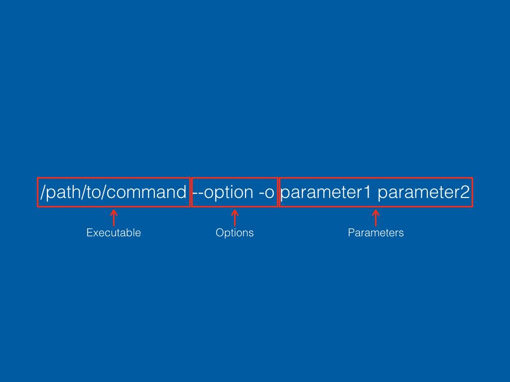
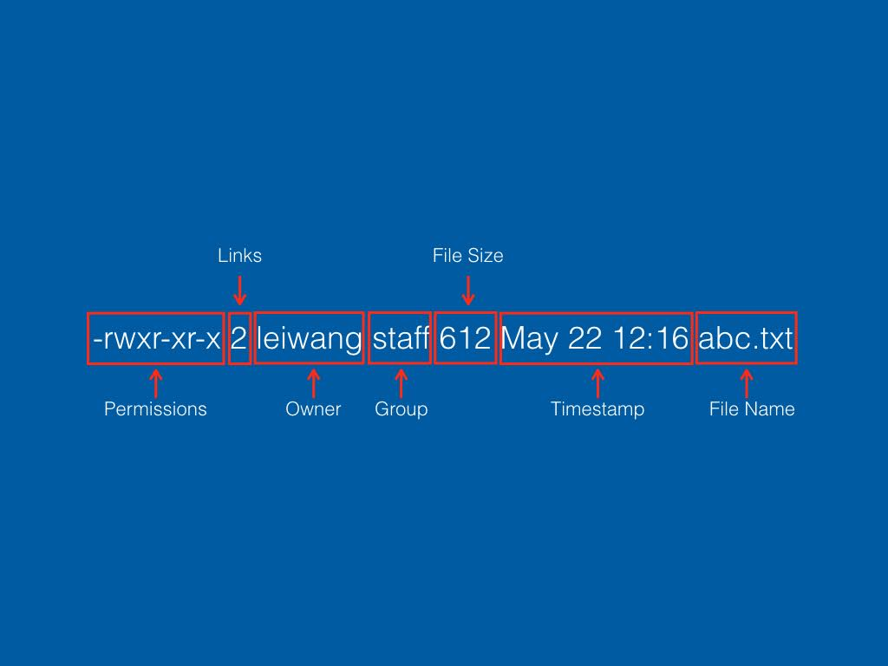
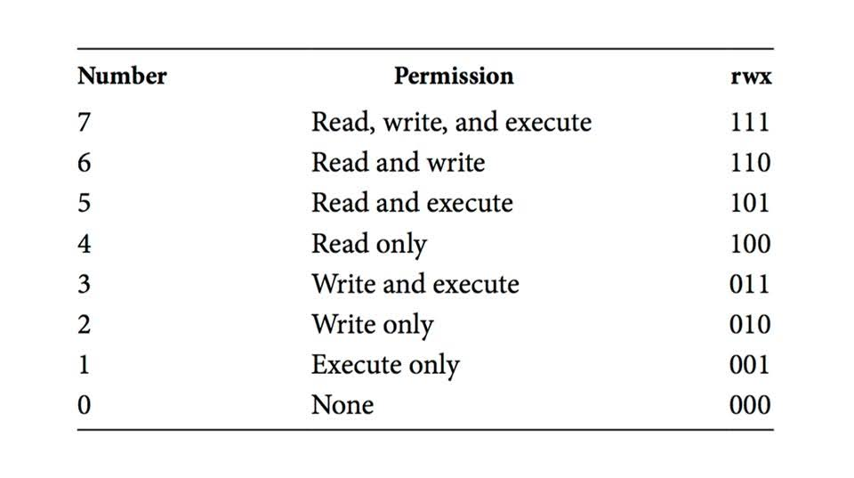

# The Very Basics of the Unix Command Line

<br/>

## Outline

* Navigating a *nix operating system with a terminal.
* Basics of running a command.
* Essential command line tools for reading and editing files.
* Fundamentals of the permission system.
* The basics of automating tasks with shell scripting.

<br/>

## Getting Basic System Information

You can get some basic **system information** by running the command `uname`:
```
uname
```

> [!TIP]
> **The Anatomy of a Command**.
> We can pass **options** (sometimes known as **flags**) to a command. The syntax usually looks like this:
> ```
> command_name [options]
> ```
> For example:
> ```
> uname -a # single dash + single letter
> uname --all # double dashes + full name
> uname -s -v # multiple single letter options
> uname --kernel-name --kernel-version # multiple full name options
> uname -sv # shorthand for multiple single letter options
> ```

To print your **user name** on the system, run:
```
whoami
```

To print the **current system date and time**, run:
```
date
```

<br/>

## Navigating the File System

To print the **present working directory**, run:
```
pwd
```

To **list** the contents of a directory, run:
```
ls [/path/to/directory]
```

> [!TIP]
> **The Anatomy of a Command**. 
> In addition to options or flags, most of the time we also need to pass **parameters** to a command. The syntax of a command therefore looks like this:
> ```
> command_name [options] [parameters]
> ```
> For example:
> ```
> ls data/sample
> ls -la data/sample
> ls -lah /workspace/unix/data/sample
> ```



> [!TIP]
> **Relative path** starts from the present working directory. For example, suppose we are currently in `/workspace/unixclass/data`:
> ```
> my_file.txt # => /workspace/unixclass/data/my_file.txt
> sample/my_file.txt # => /workspace/unixclass/data/sample/my_file.txt
> ```
> **Absolute path** starts from the root directory, so it always starts with `/`:
> ```
> /workspace/unixclass/my_file.txt
> /workspace/unixclass/data/my_file.txt
> ```

> [!TIP]
> **Special Characters**. 
> **Forward slash** `/` denotes the root directory at the beginning of a path, and is the element delimiter in the middle of a path:
> ```
> / # Root directory
> data/my_file.txt # Delimits the directory name "data" from the file name "my_file.txt"
> /workspace/unixclass/data/my_file.txt # The first slash denotes the root directory, and the subsequent ones delimit path elements
> ```
> A **single dot** `.` represents the present working directory, and **double dots** `..` represent the parent directory of the present working directory. Assume we are currently in `/workspace/unixclass/data/sample`:
> ```
> ./my_file.txt # => my_file.txt => /workspace/unixclass/data/sample/my_file.txt
> ../my_file.txt # => /workspace/unixclass/data/my_file.txt
> ```
> Sometimes you may also encounter the **tilde** character `~`, which in most Unix systems denote the user's "home directory".

> [!TIP]
> **Convenience Features in the Bash Shell**. 
> It can be tedious to always type in paths character by character, so there is a must-know convenience feature in the Bash shell (and many other shells). As you type path elements, pressing the **TAB** key will prompt the shell to attempt to auto-complete the path element.
> If you want to re-run a command you ran before, use the **ARROW** keys to cycle through your command history.
> If your terminal becomes too busy with command output, and you just want to start from a clean slate, use the `clear` command.

To **change directory**, run:
```
cd [/path/to/directory]
```
For example:
```
cd data
cd /workspaces/unixclass/data
cd ..
cd ~
cd # shorthand in most systems to go back to home directory
```

To **make directories**, run:
```
mkdir /path/to/directory
mkdir -p /path/to/directory_1 [/path/to/directory_2 ...]
```
For example:
```
mkdir data/sample_1
mkdir -p data/sample_2 data/sample_3
```

<br/>

## Copying, Moving, or Removing Files or Directories

To **copy files**, run:
```
cp [/path/to/source] [/path/to/destination]
```
For example:
```
cp data/my_file.txt data/sample_1/my_file.txt
cp data/my_file.txt data/sample_2/
cp data/my_file.txt data/sample_3/my_file_copy.txt # copy to new location with a new name
```

To **copy a directory** with its contents, use `cp` with the `-R` (recursive) (or sometimes `-r` also works) flag:
```
cp -R data/sample_1 data/sample_4
```

To **move** files or directories, use:
```
mv [/path/to/source] [/path/to/destination]
```
For example:
```
mkdir -p data/sample_5 data/sample_6 data/sample_7
mv data/my_file.txt data/sample_5/my_file.txt
mv data/sample_5/my_file.txt data/sample_6/
mv data/sample_6/my_file.txt data/sample_7/my_file_new.txt # move to new location with a new name
```
When using `mv` in the same location, it is effectively **renaming** the file or directory:
```
mv data/sample_5/my_file.txt data/sample_5/my_file_backup.txt
mv data/sample_7 data/sample_8
```

To **remove** files, use:
```
rm [/path/to/file]
```
For example:
```
rm data/sample_3/my_file.txt
```
To **remove** a directory together with its contents, use `rm` with the `-R` (recursive) (or sometimes `-r` also works) flag:
```
rm -R data/sample_5
```

> [!CAUTION]
> Unlike in Windows or macOS, the Unix command line assumes that you know what you are doing. It DOES NOT ask you for confirmation when deleting or overwriting files or directories. Therefore when using commands like `cp`, `mv`, and `rm`, you should measure twice and cut once, and make sure you do not accidentally erase an existing file with the same name or delete a file with a similar name. There is no "trash can" or "recycle bin" for these commands.

> [!TIP]
> **Special Characters**. 
> The **question mark** `?` is a wildcard character that denotes one character when specifying file names:
> ```
> cp data/sample/my_file_?.txt data/sample_1/ # => my_file_1.txt, my_file_2.txt, ...
> ```
> The **asterisk** `*` is a wildcard character that denotes any number of characters when specifying file names:
> ```
> cp data/sample/*.txt data/sample_1/ # => my_file.txt, another_file.txt, yet_another_file.txt, ...
> ```

<br/>

## Creating or Editing Files

Most people use a dedicated GUI-based text editor or IDE (integrated development environment) to create or edit files, but if you do not have access to one in a terminal environment, there are a variety of terminal-based text editors. The most commonly pre-installed one is `nano`.
```
nano [/path/to/file]
```
For example:
```
nano sample/my_file.txt
```

> [!TIP]
> At the bottom of the `nano` screen, you will find a list of keyboard shortcuts to help you with common tasks. Most importantly, press `Ctrl+O` to save (write out) the file, and press `Ctrl+X` to exit the nano program.

> [!TIP]
> You system may have other text editors installed, such as `vi`, `vim`, `emacs` etc. They all have their own keyboard shortcuts.

> [!TIP]
> To see if a command or program is available on your system, run:
> ```
> which [command_name]
> ```
> For example:
> ```
> which nano
> which vi
> which curl
> which wget
> ```

<br/>

## Downloading Files

Now let's get some sample data files on to our system, so that we can work with them. We can use the widely available `curl` command to download them from the internet.
```
curl -L -o shakespeare.txt https://bit.ly/cwml-shakespeare
curl -L -o covid.csv https://bit.ly/ct-covid-21-22
curl -L -o covid2.csv https://bit.ly/ct-covid-22-23
```
OR use the `wget` command if it's available:
```
wget https://bit.ly/cwml-shakespeare -O shakespeare.txt
wget https://bit.ly/ct-covid-21-22 -O covid.csv
wget https://bit.ly/ct-covid-22-23 -O covid2.csv
```

<br/>

## Reading Files

Now we can take a look at those files! Before we look at the contents of the files, we can get some useful information about them. Of course, we can do a `ls -l` to find out its size:
```
ls -l shakespeare.txt # size in bytes
ls -lh shakespeare.txt # size in human-readable units
```
We can get the **character, word, and line counts** of the file:
```
wc [/path/to/file]
```
For example,
```
wc shakespeare.txt # character, word, line counts
wc -l covid.csv # line count only, useful for tabular data
```

Now let's try to **display the contents** of the file (**concatenate**) using the `cat` command:
```
cat [/path/to/file]
```
For example:
```
cat shakespeare.txt
```

We just "read" the complete works of Shakespeare in 5 seconds, but that's not helpful! Now let's try to read them page by page using the `more` or `less` command:
```
more [/path/to/file]
less [/path/to/file]
```
For example:
```
more shakespeare.txt
less shakespeare.txt
```

> [!TIP]
> With `more` or `less`, you can use the spacebar to **scroll** pages and type in `q` to **quit** the interface.

For large tabular data files, we might just want to look at the **first a few rows** to get a sense of the data. We can use the `head` command to achieve that:
```
head [/path/to/file]
```
For example:
```
head covid.csv # show the first 10 lines of data
```

Sometimes it is more important to look at the **end of a file**, especially if the rows are ordered chronologically and you want to look at the most recent data. We can use the `tail` command for that:
```
tail [/path/to/file]
```
For example:
```
tail covid.csv
```

> [!TIP]
> For `head` and `tail`, we can specify the `-n` option for the number of lines to display:
> ```
> head -n 100 covid.csv # display the first 100 lines
> tail -n 50 covid.csv # display the last 50 lines
> tail -n +2 covid.csv # display all lines except the first line
> ```

If the file is large, and you want to **search** its content, `grep` is a very powerful tool. For example:
```
grep 'sweet' shakespeare.txt # find all instances of the word 'sweet'
grep –i 'sweet' shakespeare.txt # same as above but case-insensitive
grep –in 'sweet' shakespeare.txt # same as above but also print line numbers
grep –ic 'sweet' shakespeare.txt # only returns a count
```

<br/>

## How to Get Help

We cannot possibly list all commands in this tutorial, as there are so many of them, and they vary from system to system. However, you can learn how to use almost any command yourself. Arguably the most important command you should know is the `man` command. It prints the **manual** of the specified command, allowing you to learn exactly what a command does, what options are available, and what syntax to follow.
```
man command_name
```
For example, if we want to read the manual of the `ls` command, we can run:
```
man ls
```
Here we can see a brief description of the command, the general syntax, and what each option does.

Sometimes (but not always), commands may have the `--help` or `-h` option built in, which may give you more information on how to use these commands.

Of course, you can also use the good old search engine or a trusted site to find the answer to any questions you may have.

<br/>

## Directing Command Output

If we do not specify a location, the default output for most commands is `STDOUT` (standard output), which is typically the terminal itself. For example, if we want to print out the string 'Hello world', we can use the `echo` command:
```
echo 'Hello world'
```
If we close the terminal, we lose that output, which might be fine for "Hello world", but most of the time we will want to preserve the output, so that we don't have to run those commands again, or we might want to string commands together, so that the output of one command is the input of the next command. 

The `>` and `>>` characters direct the command output to be saved in a file:
```
command_name [options] [parameters] > /path/to/file
command_name [options] [parameters] >> /path/to/file
```
For example:
```
echo 'Hello world!' > hello.txt
echo 'So happy to be here!' >> hello.txt
```

The **single chevron** `>` replaces the existing content of the target file with the output of the command. This can make sense in a lot of situations, but you have to be extra careful not overwriting any file that you don't intend to overwrite. Again, the terminal usually does not ask you for confirmation.

The **double chevron** `>>`, on the other hand, appends the output of the command to the end of the target file. This is useful if you want to sequentially write content to a file, such as a log file.

The **pipe** `|` character connects two commands and feed the output of the first command to the second command:
```
command_1 [options] [parameters] | command_2 [options]
```
For example,
```
head -n 100 covid.csv | tail
```

> [!TIP]
> Sometimes commands may have output target built in as an option/flag. For example, the `curl` and `wget` commands we used previously:
> ```
> curl -L -o shakespeare.txt https://bit.ly/cwml-shakespeare # the -o flag
> wget https://bit.ly/ct-covid-21-22 -O covid.csv # the -O flag
> ```

<br/>

## Getting Started with Shell Scripting

The real power of the command line is shell scripting. Otherwise we would all just be using GUI-based apps! Scripting allows us to string commands together and automate certain tasks not possible with GUI-based applications.

To learn shell scripting, let's start with an exercise. Based on what we have learned today, what do the following commands do?

```
cat shakespeare.txt | tr -sc [:alpha:] '\n' | sort -f | uniq -ci | sort -bnfr > results-shakespeare.txt
```

```
tail -n +2 covid.csv | sort -r | cut -d , -f 2,3,4,5 > results-covid.txt
```

Now that we know what these commands do, let's put them in a file so that we never have to type in such long commands again! You can use `nano`, or your favorite text editors, to create these script files.

Let's create a script file called `top_ten`:
```
#!/bin/bash

date

read -p "Which file would you like to process?" file

echo "Now counting words used in $file ..."
cat $file | tr -sc [:alpha:] '\n' | sort -f | uniq -ci | sort -bnfr > results-${file}
echo "Done. Here are the top 10 frequently used words in $file:"
head results-${file}

date
```

Additionally, let's create another script file called `select_combine`
```
#!/bin/bash

date

COUNTER=0

for datafile in covid*.csv
do
	echo "Selecting columns from $datafile and adding them …"
	tail -n +2 $datafile | sort -r | cut -d , -f 2,3,4,5 >> results-covid.csv
	COUNTER=$((COUNTER + 1))
done

echo "All set. $COUNTER files were processed. File results-covid.csv was generated."

date
```

<br/>

## Permission System

Now that we have some scripts, we need to be able to run them as commands. However, if you try to run it, you will encounter an error. That's because when we save the scripts, the operating system sees them as no different from any other text file. They are not "executable". To understand that, we will need to understand the permission system.

The best way to explain that is to take a look at the output of the `ls -l` command:

```
ls -l top_ten
ls -l select_combine
```


You will typically find a 10-character string at the beginning of each line, which represents the permission settings for the corresponding file. Here is how to read this string:
1. The first character of the string tells us whether the item is a directory or a file. If it is a file, we use a placeholder character hyphen `-`, and if it is a directory, we use the letter `d`.
2. The next 3 characters represent the permissions for the **owner** of the file. There are 3 permissions, as represented by the 3 characters. The first indicates whether the owner can **read** the file. It is denoted by `r` if yes, and by the placeholder character hyphen `-` if not. The second character indicates whether the owner can **write** to the file. It is denoted by `w` if yes, and by the placeholder character hyphen `-` if not. The third character indicates whether the owner can **execute** the file. And you guessed it, it is denoted by `x` if yes, and by the placeholder character hyphen `-` if not.
3. The next 3 characters mean the same thing, but they are for a specific **group** of users. This can be useful if you want users who belong to a specific group to be able to have the same permissions on the file or directory. A common example is the `admin` group.
4. The last 3 characters also mean the same thing, but they are for anyone on the system.

You can see that our newly created files are not executable by anyone! Let's fix that. You will need the **change mode** command `chmod`:
```
chmod +x top_ten # make it generally executable
chmod u+x select_combine # Only make it executable for the owner
chmod g+x select_combine # Only make it executable for the group
```

This is fine, but if you read the instructions of some programs, you will often encounter `chmod` used with numbers, which are known as the **Octal Representation of File Permissions**:



So you will often see commands like these:
```
chmod 700 top_ten
chmod 750 top_ten
chmod 600 top_ten
```
Can you figure out what each of these commands does?

All these commands assume that you have sufficient permission to make changes to the permission setting of the file. What if you do not have sufficient permission to do that? Well, the owner of the file or anyone with sufficient permission will need to give you permission. If you are an administrator of the system, you are one of the **sudoers**, who can temporarily become the **root** user, which have the ultimate permission to do anything on the system. It's a lot of power, and a lot of responsibility. Typically the command looks like this:
```
sudo command_name [options] [parameters]
```

<br/>

## Running Your Shell Script

OK, now that we have made our scripts executable, we can run them!
```
./top_ten
./select_combine
```

You will notice that we prefix the commands with `./`, which instructs the shell to look for the program in the present working directory. This is the convention and best practice for running your own scripts, because if you don't specificy a specific path, the shell will first look for a command at the system level by that name. It is not only inefficient, but also could be dangerous. There are thousands of system commands, and if one of them happens to have the same name as your script, you could be running that command instead.

<br/>

## Summary

In this class, we learned:

* Navigating a *nix operating system with a terminal.
* Basics of running a command.
* Essential command line tools for reading and editing files.
* Fundamentals of the permission system.
* The basics of automating tasks with shell scripting.
